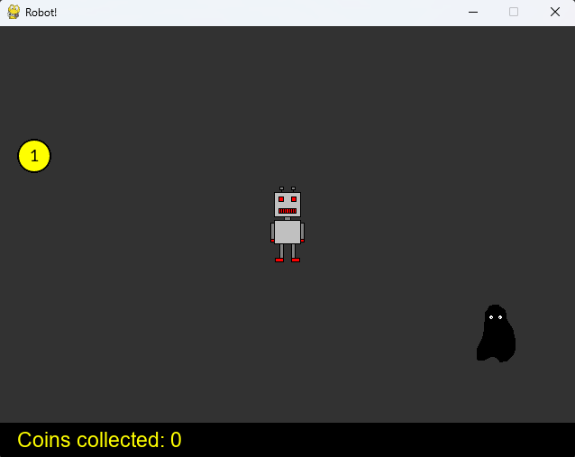

# Robot

    

## Introduction
2D game written with the help of Pygame library. It is a simple collection game, where a player controls a robot and tries to collect coins.
If the player collides with a monster, the game ends. This is a final submission for the Advanced Python course in the MOOC 2024 teaching series.

## Functionality
- The player controls a robot and is being chased by a monster. Score increases based on the coins collected.
- If the monster touches the player, the game is over and the player can restart the game.
- There is no winning condition, only collecting more coins.
- Operate the game with arrow keys. Spacebar starts a new game.
- Images have their own rectangles. No Pygame sprites were used.
- Collision is detected based on the drawn rectangle for the given image.

## Installation
- Ensure Python is installed on your system. 
- Use pip to install all required packages listed in requirements.txt (pip install -r requirements.txt). 
- Execute the main script to run the program (python main.py).